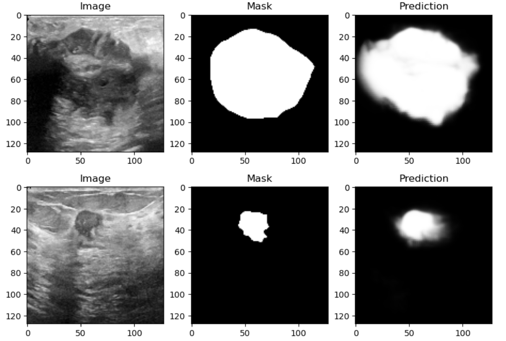

# Breast Cancer Segmentation using U-Net

## Overview

The Breast Cancer Segmentation using U-Net project applies the U-Net architecture, a powerful convolutional neural network (CNN), for accurately segmenting and identifying regions of interest within medical imaging data. Primarily focused on mammograms or breast ultrasound images, the project aims to provide a robust segmentation model for the precise identification of suspicious lesions or tumors, contributing to early and accurate breast cancer diagnosis.

## Features

- **U-Net Architecture**: The project leverages the U-Net architecture, a proven CNN design for image segmentation tasks.
- **Customizable and Extensible**: The codebase is designed to be easily customizable, allowing users to experiment with different datasets, U-Net variants, or training strategies.
- **Visualization**: The project includes visualization tools to showcase the segmentation results, aiding in model interpretation and evaluation.

## Dependencies
- **Python 3.9**
- **NumPy**
- **Matplotlib**
- **OpenCV**
- **TensorFlow**

## Acknowledgments
The deep learning model is based on [https://lmb.informatik.uni-freiburg.de/people/ronneber/u-net/]

Dataset can be downloaded from [here](https://drive.google.com/drive/folders/1fR8Mn56pz7KVAL4VqU8AEpowSrNKEM74?usp=sharing)
