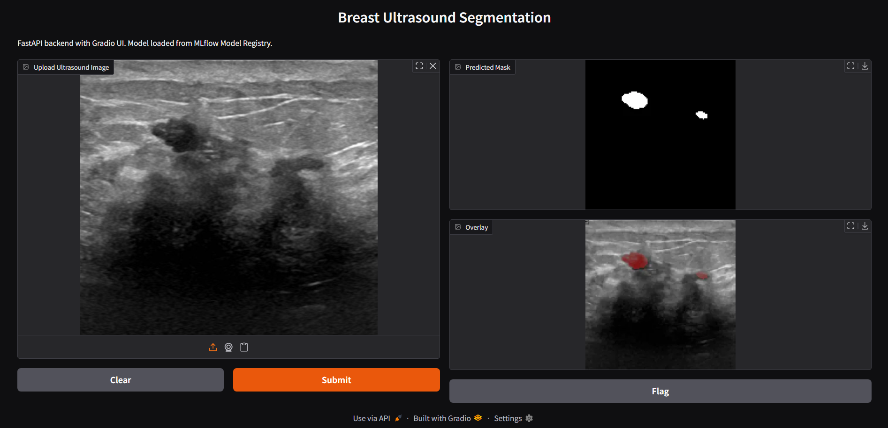

# 🩺 Breast Ultrasound Segmentation

> Semantic segmentation of breast ultrasound images using a custom U-Net architecture.  
> Trained on the BUSI dataset · Served via FastAPI · Deployed with Docker · CI/CD with GitHub Actions.


---

## 📊 Results

| Metric | Score |
|---|---|
| **Dice Coefficient** | `0.XX` |
| **IoU (Jaccard)** | `0.XX` |
| **Precision** | `0.XX` |
| **Recall (Sensitivity)** | `0.XX` |
| **Pixel Accuracy** | `0.XX` |

> Evaluated on the BUSI test set (benign + malignant + normal classes).  
> Full experiment history available in [MLflow](#experiment-tracking).

---

## 🎥 Demo



**Live demo:** Run locally with Docker (see [Quick Start](#-quick-start)) and open `http://localhost:8000/gradio`

---

## 🏗️ Architecture

```
Input (1×128×128 grayscale ultrasound)
        ↓
   Encoder (4× conv blocks + MaxPool)
   64 → 128 → 256 → 512 → 1024 channels
        ↓
   Bottleneck (1024 channels)
        ↓
   Decoder (4× ConvTranspose2d + skip connections)
   512 → 256 → 128 → 64 channels
        ↓
Output (1×128×128 binary segmentation mask)
```

Custom U-Net with:
- BatchNorm after every convolution
- Skip connections between encoder and decoder
- BCEWithLogitsLoss for training stability
- Adam optimizer with lr=1e-3

---

## 📁 Project Structure

```
Breast-Cancer-Segmentation/
├── .github/
│   └── workflows/
│       └── ci.yml              ← GitHub Actions CI pipeline
├── Data/
│   ├── Dataset_BUSI_with_GT/   ← BUSI dataset (not committed)
│   └── data_loader.py
├── Docker/
│   └── Dockerfile              ← GPU-ready container
├── Notebook/
│   └── exploration.ipynb       ← Original exploratory notebook
├── src/
│   ├── model.py                ← U-Net architecture
│   ├── train.py                ← Training loop with MLflow
│   ├── evaluate.py             ← Standalone evaluation + quality gate
│   ├── validate.py             ← Validation loop
│   ├── metrics.py              ← Dice, IoU, precision, recall
│   ├── config.py               ← Hyperparameters and paths
│   ├── mlflow_utils.py         ← Learning curves, threshold sweep
│   ├── utils.py                ← Visualization helpers
│   ├── app.py                  ← FastAPI + Gradio serving
│   └── inference.py            ← MLflow model registry inference
├── tests/
│   └── test_suite.py           ← Unit tests (model, metrics, transforms)
├── checkpoints/                ← Model weights (not committed)
├── requirements.txt
└── README.md
```

---

## 🚀 Quick Start

### Option 1 — Docker (Recommended)

```bash
# Clone
git clone https://github.com/moebouassida/Breast-Cancer-Segmentation.git
cd Breast-Cancer-Segmentation

# CPU
docker build -f Docker/Dockerfile -t breast-seg-api .
docker run --rm -p 8000:8000 breast-seg-api

# GPU
docker run --rm --gpus all -p 8000:8000 breast-seg-api
```

Open:
- **Gradio UI:** http://localhost:8000/gradio
- **API docs:** http://localhost:8000/docs
- **Health check:** http://localhost:8000/health

### Option 2 — Local Python

```bash
git clone https://github.com/moebouassida/Breast-Cancer-Segmentation.git
cd Breast-Cancer-Segmentation
pip install -r requirements.txt
uvicorn src.app:app --host 0.0.0.0 --port 8000
```

---

## 🔌 API Usage

### Health Check
```bash
curl http://localhost:8000/health
```
```json
{
  "status": "ok",
  "device": "cuda",
  "img_size": 128,
  "checkpoint_exists": true
}
```

### Predict
```bash
curl -X POST "http://localhost:8000/predict?return_images=true" \
  -H "Content-Type: multipart/form-data" \
  -F "file=@your_ultrasound.png"
```
```json
{
  "prediction_mask": [[...]],
  "device_used": "cuda",
  "threshold": 0.5,
  "mask_png_b64": "iVBORw0KGgo...",
  "overlay_png_b64": "iVBORw0KGgo..."
}
```

---

## 🧪 Training

### Dataset

[BUSI (Breast Ultrasound Images Dataset)](https://scholar.cu.edu.eg/?q=afahmy/pages/dataset)  
780 images across 3 classes: benign, malignant, normal  
Each image paired with a ground truth segmentation mask.

Download and place at:
```
Data/
└── Dataset_BUSI_with_GT/
    ├── benign/
    ├── malignant/
    └── normal/
```

### Run Training

```bash
python src/train.py
```

Training logs to MLflow automatically. View experiments:
```bash
mlflow ui --backend-store-uri file:Experiments/mlruns
# Open http://localhost:5000
```

### Evaluate a Checkpoint

```bash
# Evaluate with default quality gates
python src/evaluate.py --checkpoint checkpoints/best.pt

# Custom thresholds
python src/evaluate.py \
  --checkpoint checkpoints/best.pt \
  --dice-threshold 0.75 \
  --output-json results/eval.json
```

Example output:
```
=======================================================
  Breast Ultrasound Segmentation — Evaluation
=======================================================
  Checkpoint : checkpoints/best.pt
  Device     : cuda
=======================================================

  Metric               Value    Threshold     Status
  ----------------------------------------------------
  dice                0.XXXX       0.7000    ✅ PASS
  iou                 0.XXXX       0.5500    ✅ PASS
  precision           0.XXXX       0.6500    ✅ PASS
  recall              0.XXXX       0.6500    ✅ PASS
  pixel_accuracy      0.XXXX         (no gate)

  ✅ All quality gates passed. Model is ready for deployment.
```

---

## 📈 Experiment Tracking

All training runs are tracked with MLflow:

- Parameters: learning rate, batch size, epochs, image size
- Metrics per epoch: train loss, val Dice, val IoU, precision, recall
- Artifacts: learning curves, threshold sweep plots, prediction overlays
- Model registry: best model promoted via `models:/BreastSeg/Production`

```bash
mlflow ui --backend-store-uri file:Experiments/mlruns
```

---

## ⚙️ CI/CD Pipeline

Every push to `main` or `dev` triggers:

```
Push → Code Quality (ruff + black)
          ↓
       Unit Tests (pytest)
          ↓
       Docker Build + Smoke Test (/health)
```

Tests cover:
- U-Net output shape, gradient flow, no-NaN outputs
- Dice/IoU/precision/recall correctness on known inputs
- Full preprocessing → model → mask pipeline

---

## 🛠️ Tech Stack

| Component | Tool |
|---|---|
| Deep Learning | PyTorch |
| Medical CV Framework | MONAI-compatible transforms |
| Experiment Tracking | MLflow |
| API Serving | FastAPI |
| Interactive Demo | Gradio |
| Containerization | Docker + NVIDIA Container Toolkit |
| CI/CD | GitHub Actions |
| Dataset | BUSI (Breast Ultrasound Images) |

---

## 📜 License

MIT License — free to use and modify.

---

## 🙋 Author

**Moez Bouassida** — AI/ML Engineer · Medical Imaging & VLMs  
[](https://www.linkedin.com/in/moezbouassida/)
[](https://github.com/moebouassida)